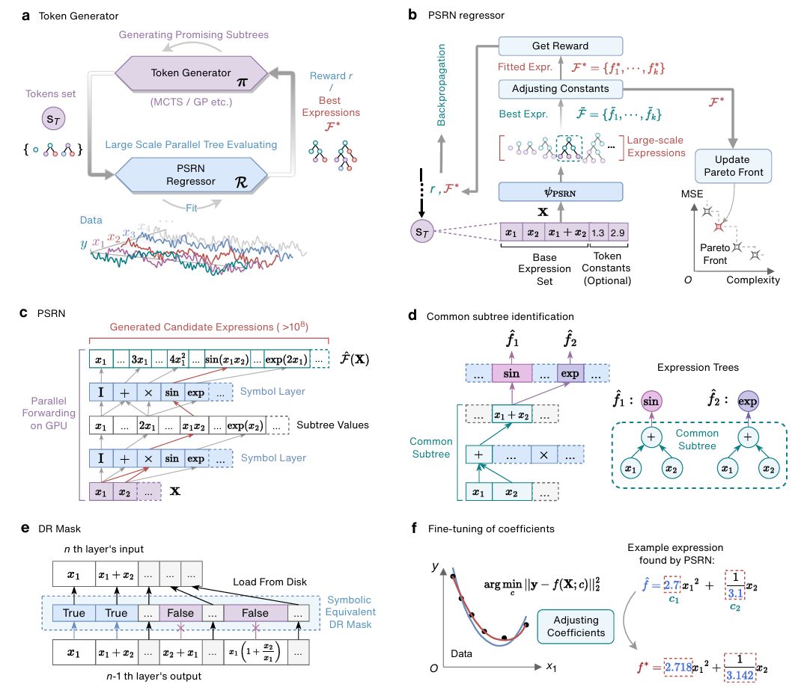
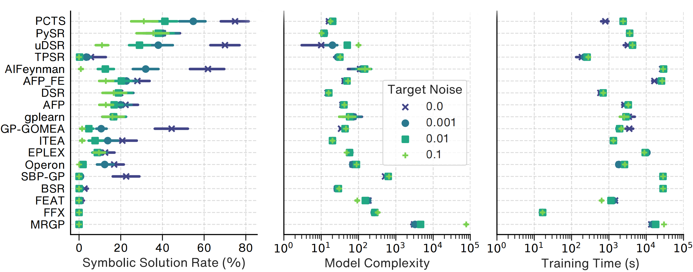

# Discovering physical laws with parallel symbolic enumeration

*Official implementation of PSE with its core PSRN (Parallel Symbolic Regression Network) module*

**Authors:** Kai Ruan, Yilong Xu, Ze-Feng Gao, Yike Guo, Hao Sun, Ji-Rong Wen, Yang Liu

[](https://www.nature.com/articles/s43588-025-00904-8)


[](https://arxiv.org/abs/2407.04405)


<!-- 

 -->


This repository contains the official PyTorch implementation of PSE (Parallel Symbolic Enumeration): A fast and efficient symbolic expression discovery method powered by PSRN (Parallel Symbolic Regression Network). PSRN evaluates millions of symbolic expressions simultaneously on GPU with automated subtree reuse.


## 📥 Installation

**Prerequisite**: Python >=3.9, <=3.12

```bash
pip install psrn
```

## 🚀 Quickstart with Custom Data

Now, you can use `psrn-run` with custom data, use the following arguments:


### Options
```bash
  -q, --csvpath TEXT           path to custom csv file

  -l, --operators         operator library (e.g., "['Add','Mul','Identity','Tanh','Abs']")
  -i, --n_inputs INTEGER       PSRN input size (n variables + n constants)
  -c, --use_constant BOOLEAN   use const in PSE

  --use_cpu BOOLEAN            use cpu
  -g, --gpu_index INTEGER      gpu index used

  --time_limit INTEGER         time limit (s)
  
  -d, --n_down_sample INTEGER  n sample to downsample in PSRN for speeding up
  -s, --seed INTEGER           seed
  -k, --topk INTEGER           number of best expressions to take from PSRN to
                               fit
  
  -o, --probe TEXT             expression probe, string, PSE will stop if
                               probe is in pf

  --experiment_name TEXT       experiment_name
  --help                       Show this message and exit.
```
For more detailed parameter settings, please use `psrn-run --help`

### 📝 CLI Examples

> [!TIP]
> - The last column of the csv should be the target variable
> - If using a version of PyTorch below 2.0, an error may occur during the `torch.topk` operation.
> - The experiments were performed on servers with Nvidia A100 (80GB) and Intel(R) Xeon(R) Platinum 8380 CPUs @ 2.30GHz.
> - We recommend using a high-memory GPU as smaller cards may encounter CUDA memory errors under our experimental settings. If you experience memory issues, consider reducing the number of input slots or opting for `semi_koza` operator sets (e.g., replacing `"Sub"` and `"Div"` with `"SemiSub"` and `"SemiDiv"`) or `basic` operator sets (e.g., replacing `"Sub"` and `"Div"` with `"Neg"` and `"Inv"`).


To run the script with build-in custom data with an expression probe (the algorithm will stop when it finds the expression or its symbolic equivalents):

```bash
psrn-run -g 0 -i 5 -c False --probe "(exp(x)-exp(-x))/2"
```

Without an expression probe:

```bash
psrn-run -g 0 -i 5 -c False
```

For limited VRAM (or when the ground truth expression is expected to be simple):

```bash
psrn-run -g 0 -i 3 -c False --probe "(exp(x)-exp(-x))/2"
```

To customize the operator library:

```bash
psrn-run -g 0 -i 5 -c False --probe "(exp(x)-exp(-x))/2" -l "['Add','Mul','Identity','Tanh','Abs']"
```

For custom data paths and operators:

```bash
psrn-run -g 0 -i 5 -c False -l "['Add','Mul','SemiSub','SemiDiv','Identity']" --csvpath ./your_data.csv
```

## 📝 Python Examples

<details>
<summary>Show Code</summary>

```python
import os
import click
import time
import numpy as np
import sympy as sp
import pandas as pd

default_csv = os.path.join(os.path.dirname(__file__), 'data', 'custom_data.csv')

@click.command()
@click.option("--experiment_name", default="_", type=str, help="experiment_name")
@click.option("--gpu_index", "-g", default=0, type=int, help="gpu index used")
@click.option(
    "--operators",
    "-l",
    default="['Add','Mul','Sub','Div','Identity','Sin','Cos','Exp','Log']",
    help="operator library",
)
@click.option(
    "--n_down_sample",
    "-d",
    default=100,
    type=int,
    help="n sample to downsample in PSRN for speeding up",
)
@click.option(
    "--n_inputs",
    "-i",
    default=5,
    type=int,
    help="PSRN input size (n variables + n constants)",
)
@click.option("--seed", "-s", default=0, type=int, help="seed")
@click.option(
    "--topk",
    "-k",
    default=10,
    type=int,
    help="number of best expressions to take from PSRN to fit",
)
@click.option("--use_constant", "-c", default=False, type=bool, help="use const in PSE")
@click.option(
    "--probe",
    "-o",
    default=None,
    type=str,
    help="expression probe, string, PSE will stop if probe is in pf",
)
@click.option(
    "--csvpath",
    "-q",
    default=default_csv,
    type=str,
    help="path to custom csv file",
)
@click.option(
    "--use_cpu",
    default=False,
    type=bool,
    help="use cpu",
)
@click.option("--time_limit", default=3600, type=int, help="time limit (s)")
def main(
    experiment_name,
    gpu_index,
    operators,
    n_down_sample,
    n_inputs,
    seed,
    topk,
    use_constant,
    probe,
    csvpath,
    use_cpu,
    time_limit,
):
    if not use_cpu:
        os.environ["CUDA_VISIBLE_DEVICES"] = str(gpu_index)

    import torch
    from .model.regressor import PSRN_Regressor

    if not use_cpu:
        device = torch.device("cuda" if torch.cuda.is_available() else "cpu")
    else:
        device = torch.device("cpu")
    print(device)

    print(operators)
    operators = eval(operators)
    print(operators)

    hp = {
        "operators": operators,
        "n_down_sample": n_down_sample,
        "n_inputs": n_inputs,
        "topk": topk,
        "seed": seed,
    }

    path_log = "./log/" + experiment_name + "/"

    if not os.path.exists(path_log):
        os.makedirs(path_log)

    df = pd.read_csv(csvpath, header=None)

    Input = df.values[:, :-1].reshape(len(df), -1)
    Output = df.values[:, -1].reshape(len(df), 1)

    variables_name = [f"x{i}" for i in range(Input.shape[1])]

    regressor = PSRN_Regressor(
        variables=variables_name,
        use_const=use_constant,
        device=device,
        token_generator_config={
            "base": {
                "has_const": use_constant,
                "tokens": operators
            }
        },
        stage_config={
            "default": {
                "operators": operators,
                "time_limit": time_limit,
                "n_psrn_inputs": n_inputs,
                "n_sample_variables": 3,
            },
            "stages": [
                {},
            ],
        },
    )

    start = time.time()
    try:
        flag, pareto_ls = regressor.fit(
            Input,
            Output,
            n_down_sample=hp["n_down_sample"],
            use_threshold=False,
            threshold=1e-20,
            probe=probe,
            prun_const=True,
            prun_ndigit=6,
            top_k=topk,
        )
        end = time.time()
        time_cost = end - start

        crits = ["reward", "mse"]

        for crit in crits:
            print("Pareto Front sort by {}".format(crit))
            pareto_ls = regressor.display_expr_table(sort_by=crit)

        expr_str, reward, loss, complexity = pareto_ls[0]
        expr_sympy = sp.simplify(expr_str)

        print(expr_str)

        print("time_cost", time_cost)
        if flag:
            print("[*** Found Expr ! ***]")

        print(expr_sympy)
    except Exception as e:
        if 'memory' in str(e):
            print(e)
            print('='*100)
            print('OOM! Please try to reduce the number of input slots (-i) of PSRN or the number of operators (-l)')
        else:
            raise e

if __name__ == "__main__":
    main()
```

</details>


## Reproducing Guides

See [Reproducing Guides](./README-reproduce-guide.md)

## 📚 Citation

If you use this work, please cite:

```bibtex
@article{ruan2025discovering,
  author     = {Ruan, Kai and Xu, Yilong and Gao, Ze-Feng and Guo, Yike and Sun, Hao and Wen, Ji-Rong and Liu, Yang},
  title      = {Discovering physical laws with parallel symbolic enumeration},
  journal    = {Nature Computational Science},
  year       = {2025},
  doi        = {10.1038/s43588-025-00904-8},
  url        = {https://www.nature.com/articles/s43588-025-00904-8}
}
```

